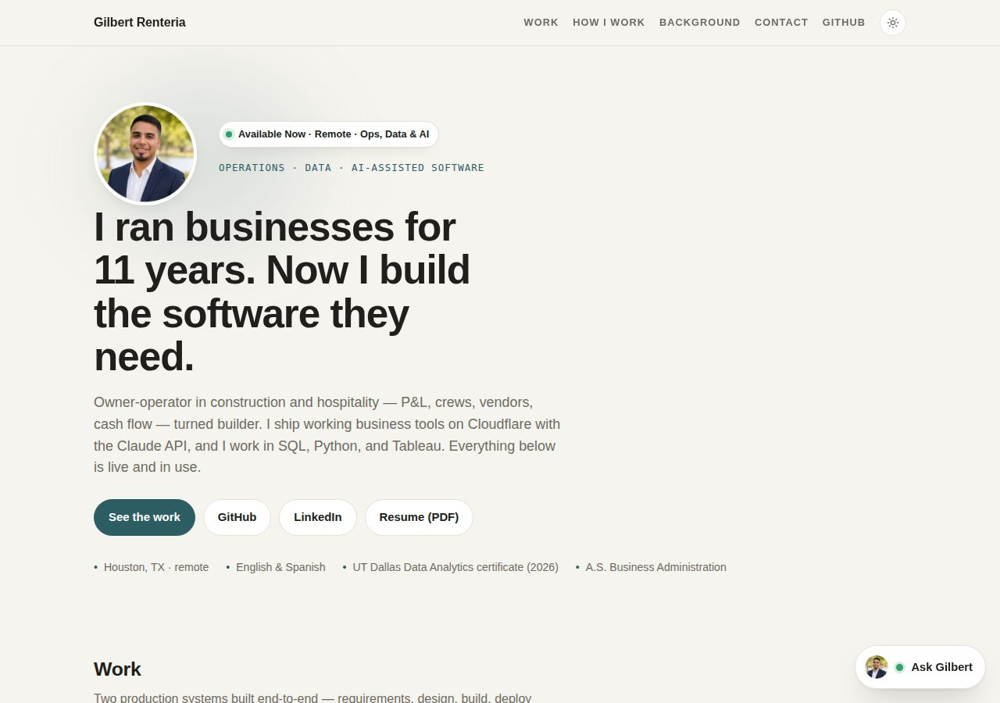

# gilbertrenteria.dev

My portfolio site, plus the small backend behind the "Ask Gilbert" chat on it.

Live: https://gilbertrenteria.dev · Built by Gilbert Renteria



## What's here

| Path | What it is |
|---|---|
| `index.html` | The site. One file: HTML, CSS, and JS inline. Light/dark theme, scroll reveal, the Ask Gilbert chat widget. |
| `customer-analytics/` | Interactive dashboard from my UT Dallas data-analytics capstone (source and write-up: [customer-analytics-capstone](https://github.com/gilbertrenteria/customer-analytics-capstone)). |
| `_worker.js` | Cloudflare Pages Function that serves the site and answers `POST /api/chat` for Ask Gilbert. |
| `img/` | Screenshots and photo. |
| `Gilbert-Renteria-Resume.pdf` | Current resume. |

## How Ask Gilbert works

The chat widget sends the conversation to `/api/chat`. The worker holds the Anthropic API key
(as a Cloudflare secret, never in this repo), adds a system prompt that describes my background
and projects, calls Claude, and returns the reply. It only answers questions about my work and
general operations/data topics.

Guardrails, all enforced in the worker:

- Allowed origins: `gilbertrenteria.dev`, `gilbertrenteria.pages.dev`.
- Per request: last 8 turns, 1,200 characters per message, 500 output tokens.
- Per day (Cloudflare KV): 300 messages site-wide, 25 per visitor. Past the cap it politely asks people to email me instead.
- A monthly spend limit in the Anthropic Console is the backstop.

## Hosting

Cloudflare Pages (direct upload), custom domain on Cloudflare Registrar, Cloudflare Web Analytics.
No build step: upload the folder, done.

Environment (Cloudflare Pages → Settings):

| Name | Type | Purpose |
|---|---|---|
| `ANTHROPIC_API_KEY` | Secret | Enables the chat. Without it the widget says the chat isn't switched on. |
| `MODEL` | Text | Claude model id. |
| `ALLOWED_ORIGINS` | Text | Comma-separated origins allowed to call `/api/chat`. |
| `DAILY_GLOBAL_CAP`, `DAILY_IP_CAP` | Text | Daily caps (defaults 300 / 25). |
| `ASK_LIMITS` | KV binding | Counter storage for the daily caps. Optional. |

## Run it locally

```bash
npx wrangler pages dev .    # serves the site + worker on localhost:8788
```

## Contact

gilbertrenteria@yahoo.com · linkedin.com/in/gilbertrenteria · github.com/gilbertrenteria
